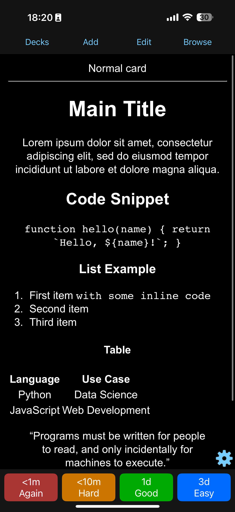
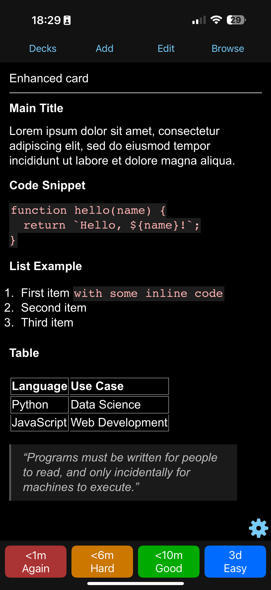

# 📚 Anki Styles for Complex Cards

Custom CSS styles for Anki cards with **long or complex content** — code snippets, tables, quotes, etc.

Including content generated by **ChatGPT**.

## 🔍 Before / After

<p align="center">
  
  <span>&nbsp;&nbsp;&nbsp;&nbsp;&nbsp;&nbsp;&nbsp;&nbsp;&nbsp;</span>
  
</p>

<p align="center">
  
  <span>&nbsp;&nbsp;&nbsp;&nbsp;&nbsp;&nbsp;&nbsp;&nbsp;&nbsp;</span>
  
</p>

## 🛠️ How to Use

1. Open your Anki card in the HTML editor
2. Paste the following CSS at the top of your card code/text
3. Enter you content as usually


```html
<style>
  li, div, code, span, th, td, blockquote,
  h1, h2, h3, h4, h5 {
    /* 
      NOTE!
      YOU CAN UPDATE NUMBER BELOW UP TO YOUR TASTE
      FOR EXAMPLE SET 0.5rem IF YOU USE
      INCREASED SCALE
    */
    font-size: 1.2rem;
    text-align:left;
    white-space: normal;
  }
  td, th {
    border-right: solid 1px black;
    border-bottom: solid 1px black;
  }
  /* Top border for the first row */
  tr:first-child td,
  tr:first-child th {
    border-top: 1px solid black;
  }
  /* Left border for the first column */
  td:first-child,
  th:first-child {
    border-left: 1px solid black;
  }
  table {
    margin: 1rem 0;
  }
  code {
   background: #eee;
   color: darkred;
   padding: 2px;
   white-space: pre-wrap;
  }
  ol, ul, li {
    /* adjust too large indents for bullets */
    padding-left: 1em;
    text-indent: -1em;
  }
  blockquote {
    padding: 0.5em 1em;
    margin-left: 0;
    font-style: italic;
    background-color: #f9f9f9;
    border-left: 3px solid #ccc;
  }

  /* 🌙 Night Mode Support */
  @media (prefers-color-scheme: dark) {
    body {
      color: #e0e0e0;
      background-color: #121212;
    }
    code {
      background: #1e1e1e;
      color: #ffb3b3;
    }
    td, th {
      border-color: #888;
    }
    /* Top border for the first row */
    tr:first-child td,
    tr:first-child th {
      border-top: 1px solid #888;
    }
    /* Left border for the first column */
    td:first-child,
    th:first-child {
      border-left: 1px solid #888;
    }
    blockquote {
      background-color: #1a1a1a;
      border-left: 3px solid #555;
      color: #bbb;
    }
  }
</style>

<!-- Optional preview block -->
<div>
  Paste your content here
</div>
```
